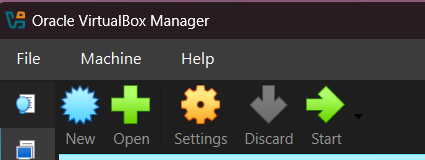
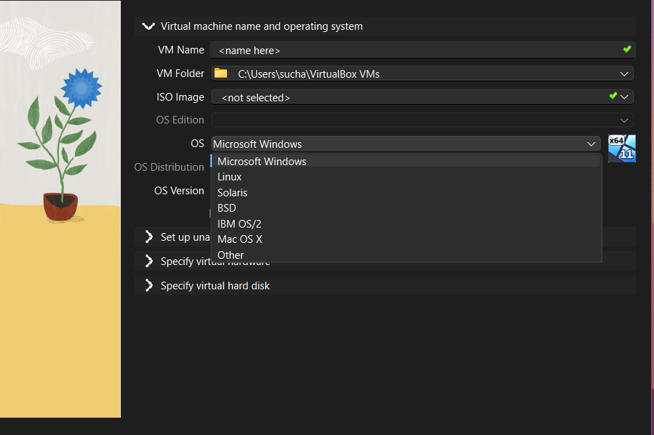
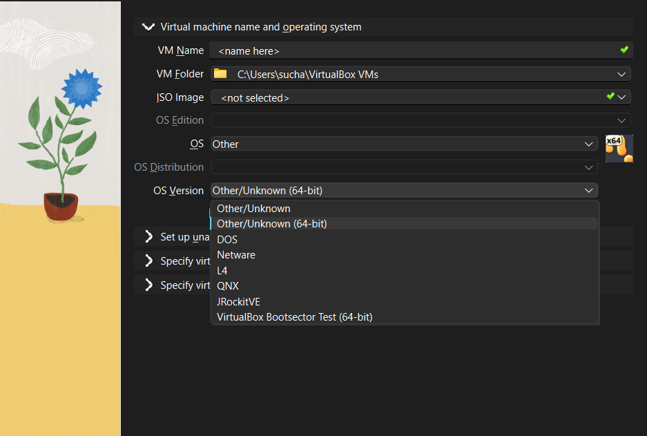
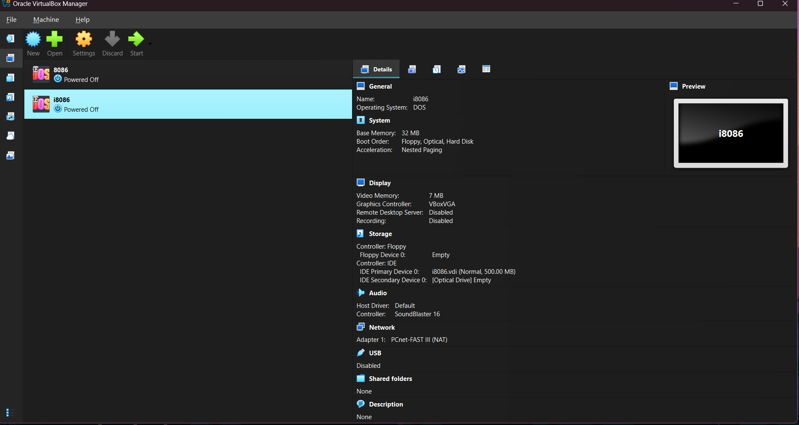
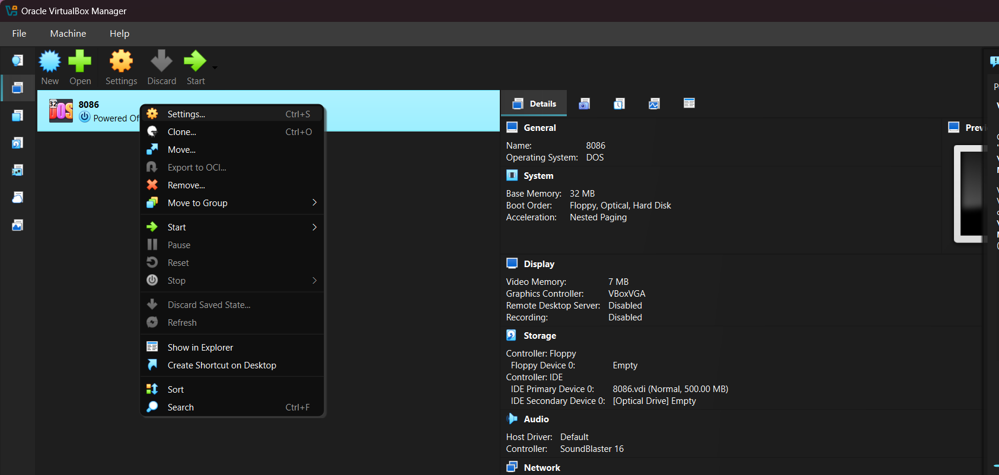
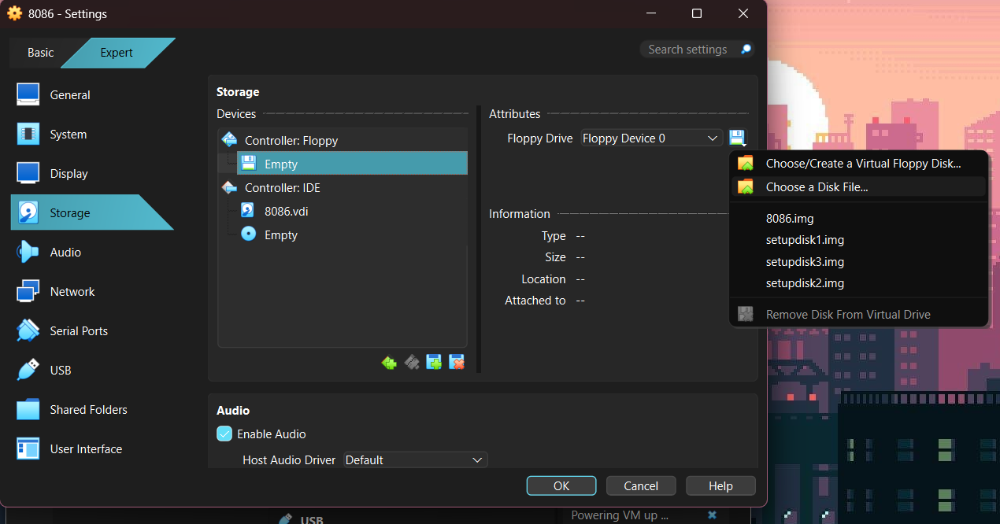
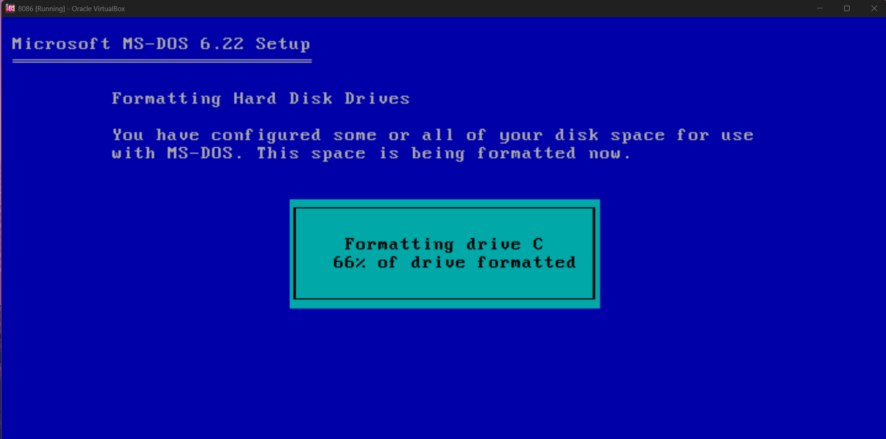
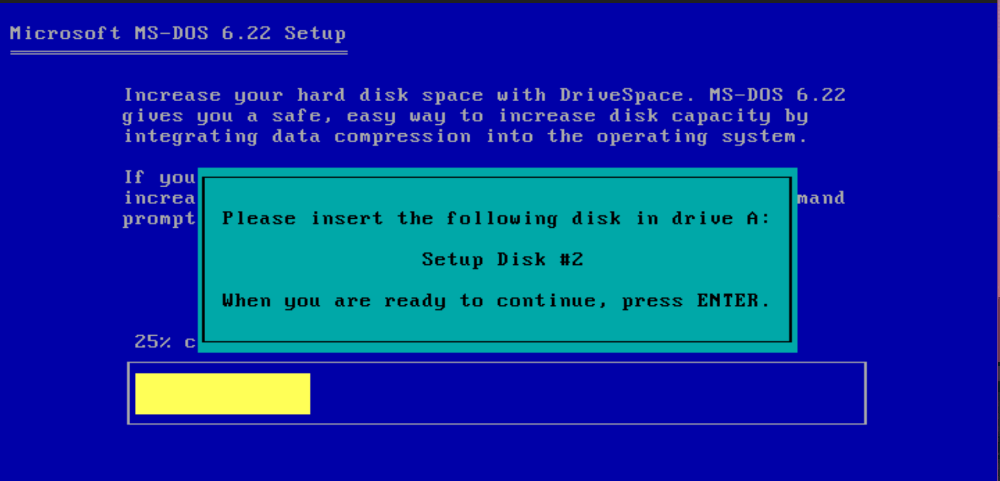
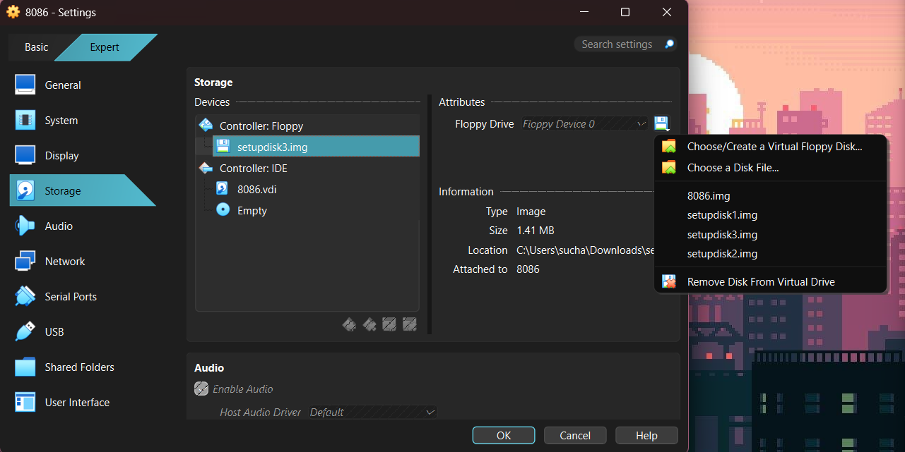
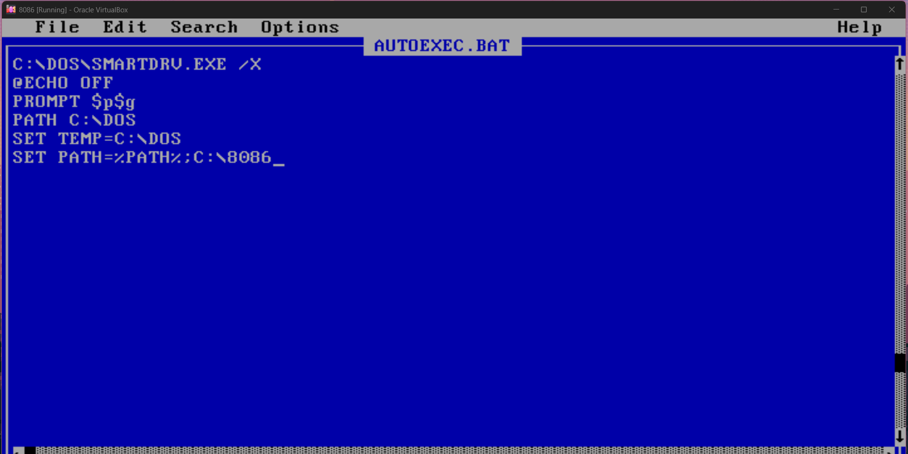

# Guide to Install MSDOS for writing 8086 assembly programs in virtual box

## Step 0: Install Virtual box

Install virtual box from [here](https://www.virtualbox.org/wiki/Downloads)

## Setting up VM

- Open virtual box and click "new"



- Set **Name** as per your wish, and choose OS as "other"



- Choose "DOS" from the list



- Specify the amount of memory, ram, etc you want the VM to have. After doing so, the VM will be created



## Setting up MSDOS

- First, install all the _setup img_ files from [here](http://cs.iiests.ac.in/download/8086/MSDOS)

- Then, right click on the VM and go to settings -> storage



- In storage, choose file from your folder and select **setupdisk1.img**



- Power on the VM and follow the instructions that appear

- Press enter to setup and format the disk, it will show a screen as follows



- On the following screen, we will again go back to our VM in virtual box -> settings -> storage and select **setupdisk2.img** file, and press enter in the VM



**Note: This process will be repeated for setupdisk3 and also for 8086.img to setup the development environment**

- After all 3 disks are done, remove the disk from storage in a similar fashion



## Installing development tools using 8086.img

- First, add the storage of 8086.img again as before (assuming downloaded from same link)

- Then, run the following commands one by one in the VM :

```bash
mkdir 8086
A:
copy *.* C:\8086
```

Should get a result like `8 files copied succesfully`

The dev tools are copied, and you can safely remove the 8086.img from the virtual disk/storage

## Setting PATH

To use the dev tools, you have to add it to path, so we will make it so that the path is set at start up from `AUTOEXEC.bat`

In the `C:\` prompt, we will write `edit AUTOEXEC.BAT`

We will add the following extra line to the file, as shown below:



you can do alt + f, and then exit -> select yes (using arrow keys)

From here, you can run AUTOEXEC.bat to set path

Now, we can write, assemble, and link assembly files
